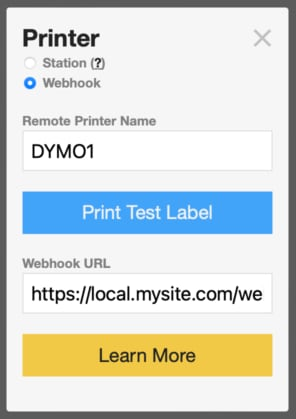

A [Node](https://nodejs.org)/[Express](https://expressjs.com) app to test whether your device is accessible over the internet (and thereby compatible with Kidddo's [Print Webhook](https://kidddo.com/print-webhook)).

	npm i express
	git clone https://github.com/Kidddo/Kidddo-Webhook-POST-Test.git
	cd Kidddo-Webhook-POST-Test
	node post.js
	// Server listening on port 3000

You should now be able to access this locally in your browser: `http://localhost:3000`. If your router or tunnel is correctly configured you should see the same response at your public url.

If your public url is `https://local.mysite.com`, don't forget to add the `/webhook` endpoint in your Kidddo [Settings](https://kidddo.com/admin#settings) > Use Label Printers > Printer Name > Webhook dialog:

	https://local.mysite.com/webhook
	
	// or if you're running on port 3000:
	https://local.mysite.com:3000/webhook

If everything's configured correctly, clicking "Print Test Label" will send the following payload to your app's console:

	{
	  "job_type": "test", // Test Print
	  "printer": "DYMO1", // Printer Name to print to
	  "timestamp": "2022-08-29 23:28:26"
	}

## Tunneling
If your router/sbs can't be configured for external access, you may want to consider using a [Tunneling](https://www.ssh.com/academy/ssh/tunneling) service such as [localhost.run](https://localhost.run) or [ngrok](https://ngrok.com). 